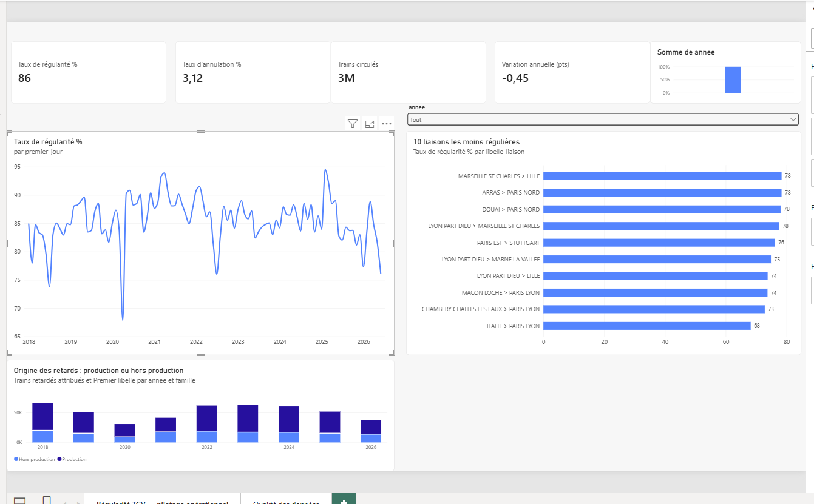
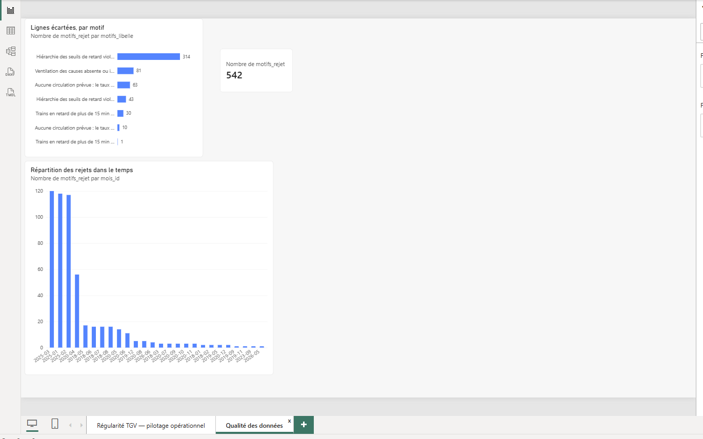

# Operational KPI Data Mart & Analytics Pipeline

Data mart analytique en étoile pour le suivi d'indicateurs opérationnels, construit
sur les données ouvertes de régularité mensuelle des TGV (source : SNCF / AQST).

**Chaîne complète** : extraction → règles de qualité avec quarantaine motivée →
modèle en étoile → couche dbt testée → restitution Power BI.




| | |
|---|---|
| Période couverte | 2018-01 → 2026-06 (102 mois) |
| Lignes sources | 12 544 |
| Lignes conformes | 12 002 (95,7 %) |
| Lignes en quarantaine | 542 (4,3 %), avec motif |
| Liaisons | 146 (59 gares, 2 services) |
| Faits de causes après dépivotage | 60 568 |
| Tests dbt | 32, tous au vert |
| Trains circulés sur la période | 3 195 193 |
| Régularité globale | 85,51 % |

---

## 1. Le problème

Suivre la performance opérationnelle d'un réseau ferroviaire suppose de répondre à
quatre questions qui ne se posent pas au même niveau :

- La régularité s'améliore-t-elle ou se dégrade-t-elle dans le temps ?
- Quelles liaisons décrochent, et de combien par rapport à la moyenne nationale ?
- Les retards viennent-ils de la production ferroviaire ou de causes qui lui échappent ?
- Peut-on faire confiance au chiffre affiché ?

Une table à plat ne répond qu'à la première. Les trois autres demandent un modèle
dimensionnel — et la quatrième demande de savoir ce qui a été écarté, et pourquoi.

## 2. Le modèle

**Grain de la table de faits principale : une ligne par (mois, service, gare de
départ, gare d'arrivée).**

Cette clé ne produit aucun doublon sur les 12 544 lignes sources. La retirer du
service en produit **42** : une même liaison peut être desservie le même mois en
service National et en service International. Le service appartient donc à la clé,
pas aux attributs — c'est la première décision du modèle, et elle est vérifiée par
les données plutôt que supposée.

```
                    dim_temps                dim_cause
                  (102 mois)               (6 causes,
                        |                2 familles)
                        |                     |
   dim_liaison ── fait_regularite      fait_retard_cause ── dim_liaison
   (146 liaisons)   (12 002 faits)        (60 568 faits)
```

Deux tables de faits, à deux grains distincts :

- **`fait_regularite`** — mois × liaison. Mesures additives (circulations prévues,
  annulées, en retard, par seuil) et taux calculés.
- **`fait_retard_cause`** — mois × liaison × cause, obtenue en dépivotant les six
  colonnes de pourcentage. Le pourcentage y devient un **nombre de trains attribués**,
  seule forme additive et donc sommable dans un tableau de bord.

### Décisions de modélisation

**Le dénominateur du taux de régularité exclut les trains annulés.**
`taux = (circulés − en retard à l'arrivée) / circulés`, avec `circulés = prévus − annulés`.
Un train annulé n'est ni à l'heure ni en retard ; le compter au dénominateur ferait
baisser la régularité pour une raison qui n'est pas un retard. Le taux d'annulation
est suivi séparément.

**Les six causes sont regroupées en deux familles.** « Causes externes » et « prise
en charge des voyageurs » relèvent de l'exploitation au sens large ; infrastructure,
gestion du trafic, matériel roulant et gestion en gare relèvent de la production
ferroviaire. C'est un choix éditorial assumé — il transforme six parts de camembert
en une question actionnable : **70,1 %** des retards attribués relèvent de la production.

**Les seuils de retard sont cumulatifs, pas disjoints.** Hypothèse testée plutôt que
supposée : la lecture par tranches disjointes (15-30, 30-60, > 60) est violée sur
8 691 lignes, la lecture cumulative sur 357. Le modèle retient la cumulative, et un
test dbt garde la règle.

**Le référentiel national est joint comme mesure de comparaison.** Un second flux
apporte la régularité composite nationale mensuelle, ce qui donne
`ecart_vs_national_pt` : une liaison n'est pas jugée dans l'absolu mais par rapport
au réseau, le même mois.

**La dimension temps est construite pour un moteur BI, pas pour un humain.** Deux
détails qui n'en sont pas :

- `premier_jour` est un vrai type `DATE`, pas une chaîne. Les fonctions de temps de
  Power BI (`DATEADD`, `SAMEPERIODLASTYEAR`…) refusent une colonne texte, et l'erreur
  ne se voit qu'au moment d'écrire la mesure de variation annuelle.
- Le trimestre se calcule avec `FLOOR((mois − 1) / 3) + 1`, pas avec un `CAST`.
  `CAST` arrondit au plus proche : `(3−1)/3 = 0,67` devient `1`, et mars bascule au
  deuxième trimestre. Même erreur pour juin, septembre et décembre — quatre mois sur
  douze dans le mauvais trimestre, sans qu'aucun test ne s'en aperçoive.

## 3. Qualité : sept règles, et une quarantaine motivée

Une ligne non conforme n'est jamais supprimée. Elle part en table de rejets **avec
le motif de son exclusion**, parce que la question qui suit un rejet est toujours
« pourquoi ».

| Règle | Lignes | Ce qu'elle attrape |
|---|---|---|
| `R01_PREVU_NUL` | 73 | Aucune circulation prévue → taux indéfini |
| `R02_ANNULE_SUP_PREVU` | 63 | Plus d'annulations que de circulations prévues |
| `R03_SEUILS_INCOHERENTS` | 357 | Hiérarchie > 15 ≥ > 30 ≥ > 60 violée |
| `R04_RETARD_SUP_PREVU` | 0 | Retards supérieurs aux circulations |
| `R05_CAUSES_INCOMPLETES` | 82 | Ventilation absente malgré des retards |
| `R06_COMPTAGE_NEGATIF` | 43 | Nombre de trains négatif |
| `R07_SEUIL15_SUP_TOTAL` | 31 | Retards > 15 min dépassant le total des retards |

Une ligne peut violer plusieurs règles : les motifs sont concaténés, pas exclusifs.
D'où 649 déclenchements pour 542 lignes rejetées.

### Ce que les règles ont révélé

**Le premier trimestre 2025 est corrompu.** Les 357 violations de hiérarchie ne sont
pas dispersées : **355 tombent sur janvier, février et mars 2025**, et touchent
quasiment toutes les liaisons de ces trois mois (118, 117, 120). Zéro ailleurs, y
compris en 2026. La colonne « > 30 min » y contient des zéros et **43 valeurs
négatives**, jusqu'à −44. Permuter les colonnes > 30 et > 60 rétablirait la hiérarchie
sur 361 lignes sur 363 — mais les valeurs négatives excluent la simple inversion.
Conclusion retenue : incident de publication sur un trimestre, pas erreur ponctuelle.
La page « Qualité des données » du tableau de bord le rend visible d'un coup d'œil.

**Le printemps 2020 se lit dans les données.** Les 63 lignes « annulés > prévus » et
les 73 lignes « aucune circulation prévue » sont toutes situées entre avril et
décembre 2020 : pendant le confinement, les circulations programmées ont été remises
à zéro alors que les annulations continuaient d'être enregistrées. La règle attrape
un artefact réel, pas un bug.

**Un test dbt a rattrapé une règle manquante.** À la première exécution,
`assert_hierarchie_seuils_retard` a échoué sur 30 lignes qui avaient franchi le filtre
amont : les règles vérifiaient la hiérarchie interne des seuils mais pas la borne
supérieure. D'où la règle `R07`, ajoutée en amont plutôt qu'un assouplissement du
test. C'est exactement le rôle qu'on attend d'une couche de tests.

**Le même fichier ne se lit pas de la même façon en pandas et en Spark.** Le CSV
compte **15 062 lignes physiques pour 12 544 enregistrements** : le champ
« Commentaire retards à l'arrivée » décrit les incidents du mois sur plusieurs
lignes, jusqu'à 28 pour un seul enregistrement, et l'écart de 2 517 correspond
exactement au nombre de sauts de ligne qu'il contient. pandas gère ces champs
multi-lignes par défaut ; Spark non, sauf `multiLine=True`. Sans cette option,
Spark coupe l'enregistrement au premier saut de ligne et perd **toutes les
colonnes suivantes — dont les six causes de retard**, situées après la colonne
commentaire. Le symptôme visible était 2 517 fragments aux gares nulles ; filtrer
ces fragments faisait passer la vérification du grain tout en laissant 698
enregistrements amputés de leurs causes. La comparaison des comptes entre les
deux moteurs est le seul moyen de s'en apercevoir — d'où la vérification du grain
et des volumes **à chaque étape** plutôt qu'une seule fois en fin de chaîne.

**Un pipeline peut « réussir » en produisant zéro ligne.** Le portage PySpark
construisait les motifs de rejet avec `array_remove(array(...), None)`. Or dans
Spark, `array_remove` renvoie **NULL** lorsque l'élément à retirer est NULL :
la colonne valait NULL partout, `size(NULL)` n'est ni `0` ni `> 0`, et les deux
filtres qui suivent — conformes et rejets — ne retenaient plus rien. Aucune
erreur levée, trois tables Delta écrites, `conformes : 0   rejetées : 0`.

Deux conséquences, appliquées au notebook :

- Les motifs se construisent désormais avec `concat_ws`, qui ignore nativement
  les NULL.
- **Un contrôle qui ne vérifie pas le volume ne vérifie rien.** La vérification
  du grain passait sans broncher : zéro ligne, zéro doublon. Le notebook impose
  maintenant `assert d.count() == 12544` avant le contrôle d'unicité, et
  `conformes + rejetées == total` après application des règles.

**Delta refuse les espaces dans les noms de colonnes.** L'écriture en table gérée
a échoué sur deux colonnes oubliées dans la chaîne de renommage. Le notebook
vérifie désormais l'ensemble des noms avant l'écriture et nomme la colonne
fautive, au lieu de laisser l'erreur remonter du moteur de stockage.

**Trois colonnes ont été écartées de la source**, et c'est documenté : deux colonnes
de commentaires vides sur 100 % des lignes, et « retard moyen > 15 min (si liaison
concurrencée par vol) », qui recopie le retard moyen à l'arrivée sur 2 135 lignes —
libellé non fiable.

## 4. La couche dbt

dbt n'orchestre pas le chargement : il **documente, teste et expose** au-dessus du
modèle en étoile. 32 tests, tous au vert.

- Tests génériques **écrits sur mesure** (`macros/tests_generiques.sql`) plutôt
  qu'importés : `intervalle_accepte` et `combinaison_unique`. Le projet n'a aucune
  dépendance externe et les règles restent lisibles dans le dépôt.
- Tests d'intégrité référentielle entre faits et dimensions.
- Trois tests singuliers portant les règles métier : somme des causes à 100 %,
  hiérarchie des seuils, absence de fait orphelin.
- Seuils métier en `vars` du `dbt_project.yml`, versionnés en Git plutôt qu'écrits
  en dur dans les requêtes.

## 5. Ce que le data mart montre

- **La régularité de 2026 est revenue au niveau de 2018** : 82,14 % contre 82,34 %,
  après un pic à 88,7 % en 2021 — année de trafic réduit.
- **Les liaisons les moins régulières sont structurellement les mêmes** sur 98 mois :
  Chambéry–Paris Lyon (73,0 %), Lyon Part-Dieu–Lille (73,8 %), Mâcon–Paris Lyon (74,0 %).
- **70,1 % des retards attribués relèvent de la production ferroviaire**, le reste
  de causes externes et de la prise en charge des voyageurs.

Les mêmes agrégats calculés en local (DuckDB) et sur Databricks (PySpark, Delta)
donnent des résultats **identiques sur les neuf années** — c'est la vérification
qui justifie de maintenir les deux implémentations.

## 6. Organisation du dépôt

```
├── src/
│   ├── 01_extract.py                    CSV -> Parquet, schéma explicite, horodaté
│   ├── 02_transform.py                  7 règles de qualité, quarantaine motivée
│   └── 03_load_star.py                  modèle en étoile (DuckDB + SQL)
├── notebooks/
│   └── databricks_transformation_pyspark.py   même logique, distribuée, écriture Delta
├── dbt_kpi/
│   ├── models/staging/                  stg_regularite, stg_causes
│   ├── models/marts/                    mart_regularite_mensuelle, mart_causes_par_famille
│   ├── macros/tests_generiques.sql      intervalle_accepte, combinaison_unique
│   ├── tests/                           3 tests singuliers (règles métier)
│   └── profiles.example.yml             profil à copier, jamais versionné
├── docs/
│   ├── powerbi.md                       modèle, relations, mesures DAX, visuels
│   └── dashboard_*.png                  captures du tableau de bord
└── data/                                ignoré par Git — voir ci-dessous
```

## 7. Exécution

Les fichiers sources ne sont pas versionnés. Les télécharger depuis
[SNCF Open Data](https://ressources.data.sncf.com) et les déposer dans `data/raw/`
sous les noms `regularite_liaison_mensuelle.csv` et
`regularite_nationale_mensuelle.csv`.

```bash
pip install -r requirements.txt

# Les trois scripts résolvent leurs chemins depuis la racine du dépôt :
# ils fonctionnent quel que soit le dossier d'où on les lance.
python src/01_extract.py      # CSV -> Parquet, schéma explicite
python src/02_transform.py    # règles de qualité, quarantaine motivée
python src/03_load_star.py    # modèle en étoile (DuckDB + SQL)

cd dbt_kpi && dbt build       # 32 tests
```

**Configuration dbt** — le profil n'est pas versionné (il porte des identifiants
sur un vrai entrepôt). Copier `dbt_kpi/profiles.example.yml` vers
`~/.dbt/profiles.yml` (Linux/macOS) ou `%USERPROFILE%\.dbt\profiles.yml`
(Windows), puis lancer `dbt` **depuis le dossier `dbt_kpi/`** : le chemin
`../data/out/kpi.duckdb` du profil est relatif au dossier d'exécution.

`dbt build` sur une base vide n'échoue pas franchement : DuckDB crée le fichier
et les tests remontent « Table does not exist ». Si c'est le cas, les trois
scripts Python n'ont pas encore tourné.

La transformation existe aussi en **PySpark pour Databricks**
(`notebooks/databricks_transformation_pyspark.py`) : mêmes règles, même table de
rejets, exécution distribuée et écriture en Delta. Le notebook détecte le catalogue
disponible (`workspace` sur l'édition gratuite, `main` ailleurs) plutôt que de le
supposer.

## 8. Restitution

Les tables du modèle sont exportées en Parquet dans `data/out/`, prêtes à charger
dans Power BI. `docs/powerbi.md` détaille le modèle de données, les relations, les
mesures DAX et la construction des huit visuels sur deux pages — dont une page
entière consacrée à ce qui a été **écarté** : la plupart des tableaux de bord ne
montrent que ce qui a survécu.

---

### Stack

Python (pandas, pyarrow) · SQL · DuckDB · PySpark / Databricks · Delta Lake · dbt · Power BI

### Source des données

[SNCF Open Data — Régularité mensuelle des TGV (AQST)](https://ressources.data.sncf.com)
et régularité mensuelle nationale. Licence ouverte (Etalab).
